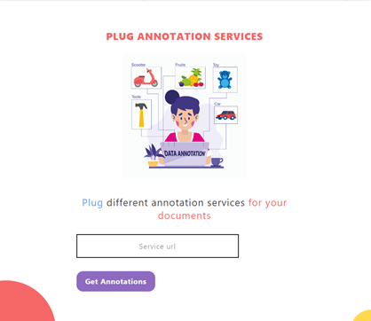

# Akshara - Auto Annotation Platform [](https://github.com/sindresorhus/awesome#readme)
> Auto annotation - Model Pooling - Plug n play Annotation Services 
----

## ```>``` Platform is available at: 
````
https://services.iittp.ac.in/annotator
````

## ```>``` Steps to setup Akshara
---
## Initial setup
### ```</>``` Open config.py in the folder ```annotator```
````
Set root_directory to the path of the folder where this repository is downloaded 
````
### ```</>``` Open config.py in the folder ```model-building```
````
Set root_directory to the path of the folder where this repository is downloaded 
````
### ```</>``` Open the file ```global_variables.pl``` in the folder ```annotator/static/perl```
```
Set $LM_HOME to path of the folder annotator
```
---
## Managing dependencies
### ```</>``` Open ```terminal``` in the ```root_folder```
````
pip install -r requirements.txt
````
---

## Setting up MongoDB

#### ```1.``` Install ```MongoDB shell``` in your linux machine ["https://docs.mongodb.com/manual/administration/install-on-linux/"]  
#### ```2.```  Type ```mongo``` on terminal and it should open the ```MongoDB shell``` on the terminal
#### ```3.``` Type the following commands to create ```databases``` and ```collections``` needed:
````
use test_database
use models
db.createCollection('bounding_regions')
db.createCollection('user_models')
use anno_admin
db.createCollection('author_job')
````
---

## Starting services

### ```1.``` Open ```2 terminals``` in the folder ```model_building```
````
On one terminal the file named build-annotator.py should be runned with the command given below
python3 build-annotator.py

On other terminal the file named auto-annotator.py should be runned with the command given below
python3 auto-annotator.py
````

### ```2.``` Run the ```bash script``` in the folder ```annotator-web-tool```
````
Open the folder named annotator-web-tool and run the bash script file using the commands given below
chmod +x bash.sh
./bash.sh
````
### ```3.``` Open browser, enter ```http://0.0.0.0:7000``` 
````
Open the browser the enter the URL http://0.0.0.0:7000 to avail the services
````
---

## Plug n Play Annotation Services
````
First we have go to (http://services.iittp.ac.in/annotator/annotate) and scroll down to see
the preview of serices as shown in the below image. And enter the URL of the specific language 
to get auto annotated . Before enetered the service 
````
### ```1.``` Open ```/usr/share/tesseract-ocr/4.00/tessdata``` and put the corresponding language specific dataset in the location

### ```2.``` Open ```annotation services``` and put the file  ```plug_'language'-annotator.py``` in it
````
In this file the (upload folder) fill the folder model_building and a specific to each 
language like annotation_services_images_language
And create aroute specific to language (/plug/tesseract-'language')
And also give a new port to each language
````
### ```3.``` Open ```annotation services``` and put the file  ```plug_'language'.py``` in it
````
In this file you have to refer to in the varaible field tessdata_dir_config =
/usr/share/tesseract-ocr/4.00/tessdata
And the language lang = 'language'
By doing all these the service is ready to operare on the url 
http://0.0.0.0:'port specific to language'/plug/tesseract-'specific language'
````
### ```4.```
````
By entering the URL on the url tab and click on Get Annotations to get the
annotated image for the uploaded image depending upon the language
````



